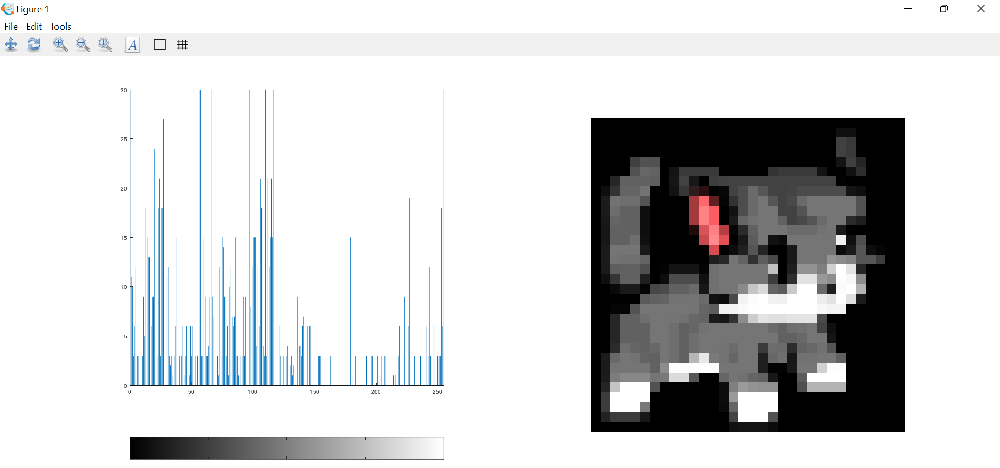

### Tugas 2 Pemrosesan Citra Digital

Nama : Delphia Aryana

NIM : 2110131220012

<h2 align="center">Eksplorasi <i>Octave</i> dengan <i>Package Image</i></h2>

Seperti yang kita ketahui, sebuah gambar memiliki 3 layer warna, yaitu merah _(red)_, hijau _(green)_ dan biru _(blue)_. Perhatikan gambar di bawah ini :

1. Gambar dan Histogram Dasar

 

2. Gambar dan Histogram Merah <i>(Red)</i>

 

3. Gambar dan Histogram Hijau <i>(Green)</i>

 

4. Gambar dan Histogram Biru <i>(Blue)</i> 

 

## Fungsi-fungsi yang dipakai :

- __imread__ : berfungsi untuk membaca sebuah <i>file</i> gambar berada.
- __imshow__ : berfungsi untuk menampilkan objek gambar.
- __imhist__ : berfungsi untuk menampilkan <i>image</i> dalam bentuk histogram.

