### Tugas 3 Pemrosesan Citra Digital
Nama : Delphia Aryana

NIM : 2110131220012

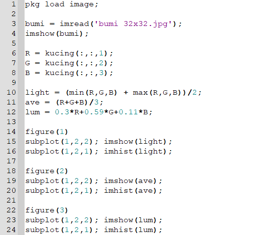

## Ligthness Method

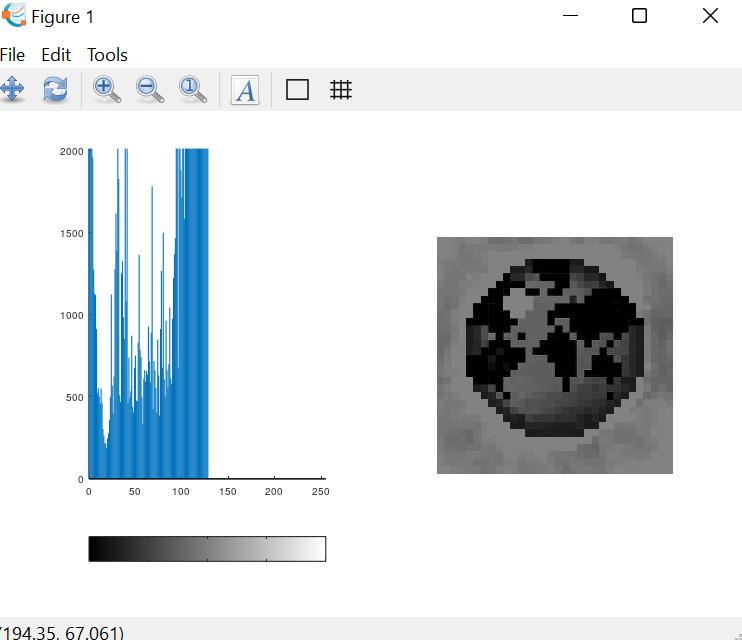

Metode yang sangat sederhana adalah dengan mengambil nilai rata-rata yaitu menjumlahkan nilai tertinggi dan terendah. Kita dapat dengan mudah melihat bahwa metode ini menghadirkan kelemahan yang sangat serius karena satu komponen RGB tidak digunakan. Ini jelas merupakan masalah karena jumlah cahaya yang dilihat mata kita bergantung pada ketiga warna dasar.

 

## Average Mathod

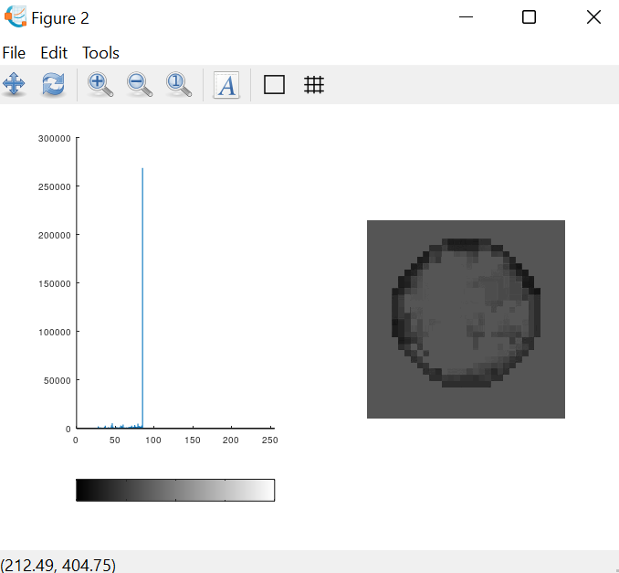

Cara lain adalah dengan mengambil nilai rata-rata dari ketiga komponen (merah, hijau, dan biru). Meskipun sekarang kita memperhitungkan semua komponen, metode rata-rata juga bermasalah karena memberikan bobot yang sama untuk setiap komponen. Berdasarkan penelitian tentang penglihatan manusia, kita tahu bahwa mata kita bereaksi terhadap setiap warna dengan cara yang berbeda. Secara khusus, mata kita lebih sensitif terhadap hijau, lalu merah, dan akhirnya biru. Oleh karena itu, bobot dalam persamaan di atas harus berubah.

## Luminosity Method

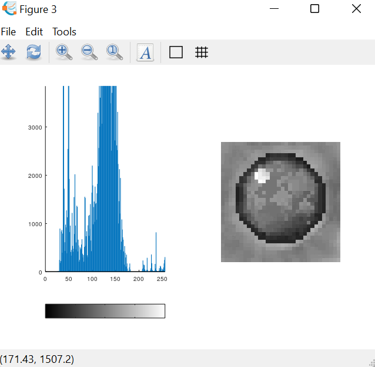

Metode terbaik adalah metode luminositas yang berhasil memecahkan masalah metode sebelumnya. Berdasarkan pengamatan di atas, kita harus mengambil rata-rata tertimbang dari komponen. Kontribusi warna biru pada nilai akhir harus berkurang, dan kontribusi warna hijau harus meningkat. Metode lightness cenderung mengurangi kontras. Metode luminositas bekerja paling baik secara keseluruhan dan merupakan metode default yang digunakan jika Anda meminta untuk mengubah gambar dari RGB ke skala abu-abu.

 

<h1 align="center">HALFTONING</h1>

Halftoning atau halftoning analog adalah proses yang mensimulasikan nuansa abu-abu dengan memvariasikan ukuran titik-titik hitam kecil yang diatur dalam pola yang teratur. Teknik ini digunakan dalam printer, serta industri penerbitan. Jika Anda memeriksa sebuah foto di koran, Anda akan melihat bahwa gambar itu terdiri dari titik-titik hitam meskipun tampaknya terdiri dari abu-abu. Hal ini dimungkinkan karena integrasi spasial yang dilakukan oleh mata kita. Mata kita memadukan detail halus dan merekam intensitas keseluruhan [1]. Halftoning digital mirip dengan halftoning di mana gambar didekomposisi menjadi kotak sel halftone. Elemen (atau titik yang digunakan halftoning dalam mensimulasikan nuansa abu-abu) dari sebuah gambar disimulasikan dengan mengisi sel halftone yang sesuai. Semakin banyak jumlah titik hitam dalam sel halftone, semakin gelap sel tersebut. Misalnya, pada gambar di bawah ini, sebuah titik kecil yang terletak di tengah disimulasikan dalam halftoning digital dengan mengisi sel halftone tengah; demikian juga, titik ukuran sedang yang terletak di sudut kiri atas disimulasikan dengan mengisi empat sel di sudut kiri atas. Titik betuihusar yang menutupi sebagian besar area pada gambar ketiga disimulasikan dengan mengisi semua sel halftone.

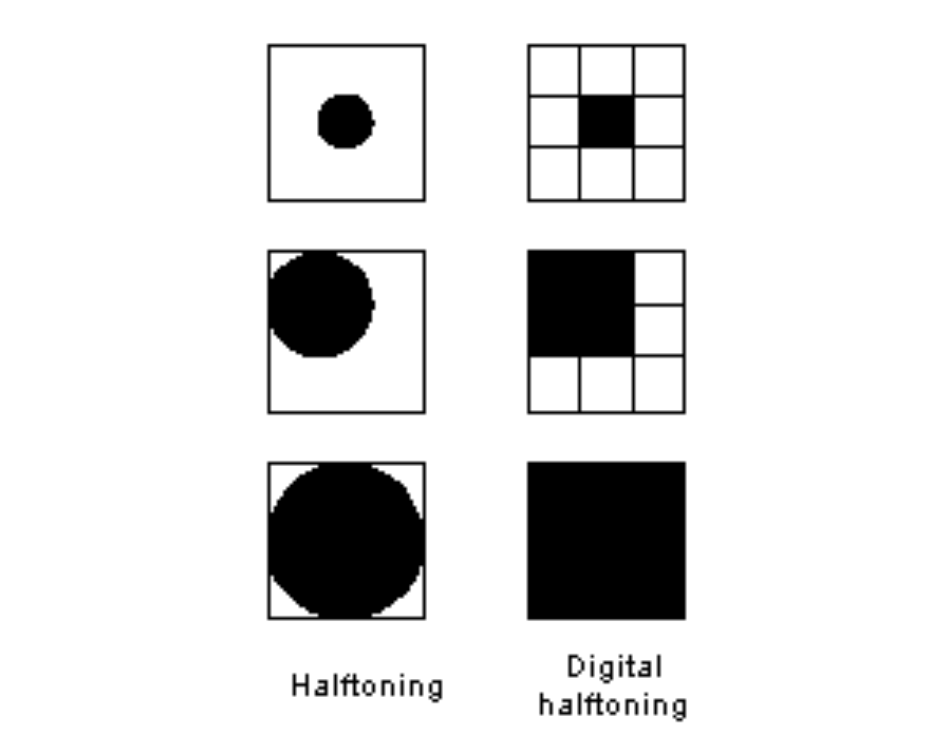

Digital halftoning adalah suatu proses untuk mengkonversi citra yang kontinu ke dalam suatu array berupa titik-titik. Jika dilihat oleh sistem visual manusia, pola tersebut akan menciptakan suatu ilusi sehingga citra tersebut tampak bukan seperti citra hitam putih, namun seperti citra abu-abu yang kontinu. Metode yang paling sederhana untuk mengkonversi citra abu-abu menjadi citra biner adalah dengan menggunakan ambang batas, yaitu dengan dua tingkat (satu bit) kuantisasi [3]. Misalkan f(i,j) adalah sebuah citra abu-abu, dan b(i,j) adalah citra yang dihasilkan dari metode ambang batas yang sederhana. Untuk ambang batas T, citra biner dihitung dengan sebagai berikut:

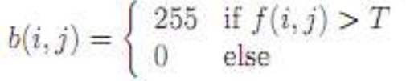

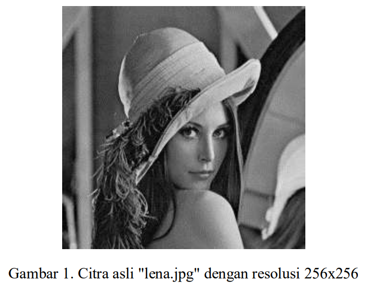

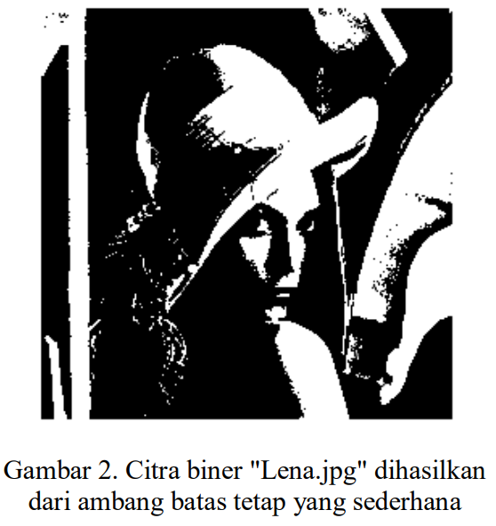

Gambar 1 dan Gambar 2 menunjukkan bahwa citra biner tidak “berbayang” dengan benar. Beberapa artefak di dalam citra tampak sebagai contouring palsu. Hal ini sering terjadi jika kuantisasi dilakukan pada bitrate rendah (dalam hal ini adalah satu bit), sehingga terjadi kesalahan kuantisasi. 

Halftoning bertujuan untuk memberikan kesan warna citra biner tampak seperti citra abu-abu meskipun hanya menggunakan piksel warna hitam dan putih saja. Meskipun teknik ambang batas(thresholding) yang sederhana ini dapat mengkonversi citra abu-abu menjadi citra biner, namun kualitas citra yang dihasilkan masih kurang baik. Untuk memperbaiki keterbatasan ini, pada tulisan ini akan disimulasikan citra biner yang dikonversi dari citra abu-abu menggunakan metode ordered dithering[4].

 

<h1 align="center">PATTERNING</h1>

Pola adalah yang paling sederhana dari tiga teknik untuk menghasilkan gambar halftoning digital. Ini menghasilkan gambar yang memiliki resolusi spasial lebih tinggi daripada gambar sumber. Jumlah sel halftone citra keluaran sama dengan jumlah piksel citra sumber. Namun, setiap sel halftone dibagi lagi menjadi kotak 4x4. Setiap nilai piksel input diwakili oleh jumlah kotak terisi yang berbeda dalam sel halftone. Karena kisi 4x4 hanya dapat mewakili 17 tingkat intensitas yang berbeda, gambar sumber harus dikuantisasi. Gambar 4.2 menunjukkan matriks pola rekursif Rylander, yang akan digunakan dalam daftar 4.1, dan contoh operasi pola.

<i>Matriks pola rekursif Rylander</i>

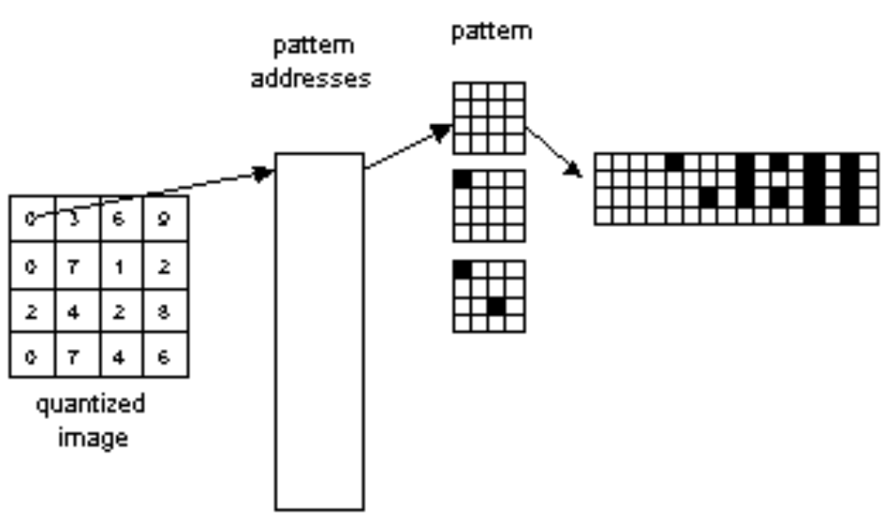

<i>Operasi Pola</i>

Pattern menghasilkan gambar halftoning digital dari gambar input menggunakan teknik pola. Pola program membaca gambar input, mengkuantisasi nilai piksel, dan memetakan setiap piksel ke pola yang sesuai. Gambar yang dihasilkan 16 kali lebih besar dari aslinya. Gambar yang dihasilkan ditulis ke file output sebagai file TIFF. Sebuah kata peringatan: "pola" membutuhkan banyak perhitungan, gambar berukuran kurang dari 100x100 direkomendasikan.

Berikut merupakan contoh menghasilkan gambar halftoning digital dari PAINTER menggunakan teknik pola.

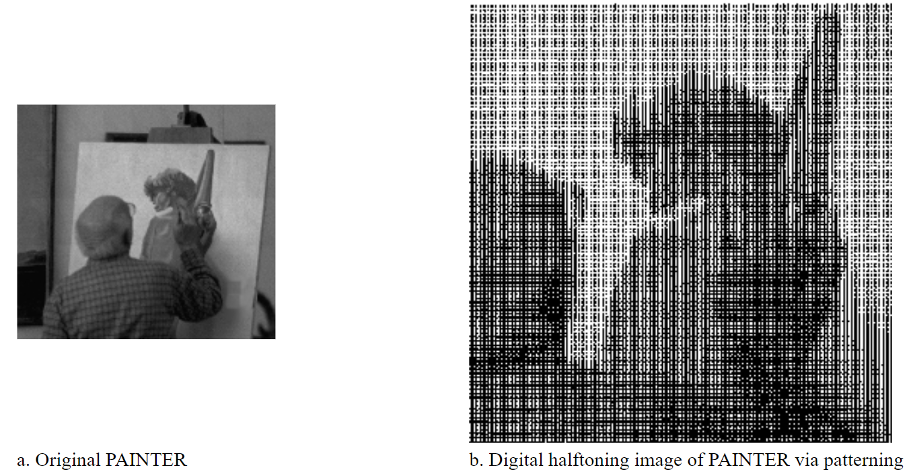

 

<h1 align="center">DITHERING</h1>

Teknik lain yang digunakan untuk menghasilkan gambar halftoning digital adalah dithering. Tidak seperti pola, dithering membuat gambar keluaran dengan jumlah titik yang sama dengan jumlah piksel pada gambar sumber. Dithering dapat dianggap sebagai thresholding gambar sumber dengan matriks gentar. Matriks diletakkan berulang kali di atas gambar sumber. Dimanapun nilai piksel gambar lebih besar dari nilai dalam matriks, titik pada gambar output diisi. Masalah dithering yang terkenal adalah menghasilkan artefak pola yang diperkenalkan oleh matriks ambang batas tetap. Gambar 4.5 menunjukkan contoh operasi dithering.

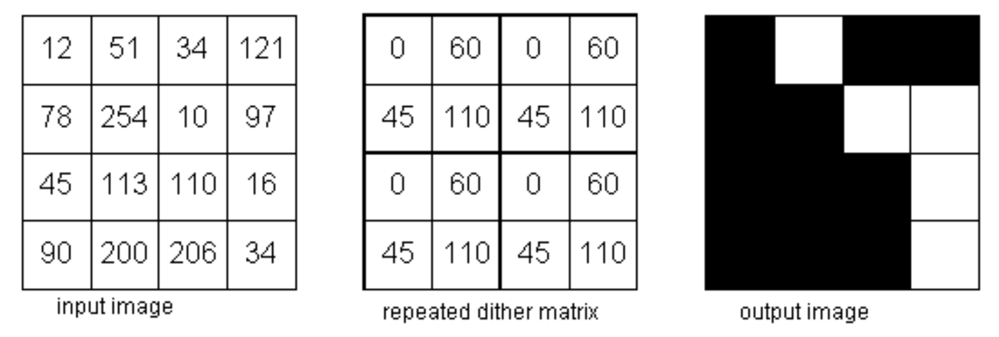

 

## Menentukan Pola pada Patterning dan Dithering

__1. Patterning__

Untuk mengetahui banyaknya pola pada patterning, dapat langsung kita tentukan dengan menghitung banyaknya font biner atau pattern pengganti terlebih dahulu kemudian ditambahkan dengan 1. Contohnya, saat kita menggunakan 4 x 4 font biner, maka banyaknya pola didapat adalah 17 pola. Pola yang ada pada patterning tidak boleh sama, pola yang sudah ada tidak boleh digunakan lagi (diputar dianggap sama).

__2. Dithering__

Mungkin saja kita membuat ilusi dari beberapa tingkat keabuan di dalam sebuah citra biner yang dalam kenyataanya hanya terdiri dari dua tingkat abu-abu. Hal ini karena sistem visual manusia cenderung meratakan suatu area di sekitar piksel, bukan melihat setiap piksel secara sendiri-sendiri.

Untuk sebagian besar tujuan dithering, cukup menambahkan nilai ambang batas ke setiap piksel (tanpa melakukan normalisasi dengan mengurangi 1⁄2), atau secara setara, untuk membandingkan nilai piksel dengan ambang batas: jika nilai kecerahan piksel kurang dari nomor di sel matriks yang sesuai, plot piksel itu hitam, jika tidak, plot putih.

 

## Menentukan Matriks Dithering (Matriks Treshold)

Thresholding merupakan salah satu metode segmentasi citra di mana prosesnya didasarkan pada perbedaan derajat keabuan citra. Dalam proses ini dibutuhkan suatu nilai batas yang disebut nilai threshold. <i>Ordered Dithering</i> dilakukan dengan membandingkan tiap blok dari citra asli dengan sebuah matriks pembatas (matriks <i>treshold</i>) yang disebut dengan matriks <i>dither</i>. Nilai intensitas citra yang lebih dari atau sama dengan nilai <i>threshold</i> akan diubah menjadi hitam (0) sedangkan nilai intensitas citra yang kurang dari nilai <i>threshold</i> akan diubah menjadi putih (1). Citra keluaran dari hasil thresholding adalah berupa citra biner. Nilai <i>threshold</i> matriks dapat ditentukan dengan persamaan :

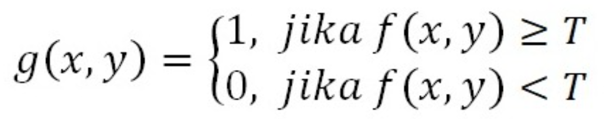

keterangan :

f(x, y) = citra grayscale

g(x, y) = citra biner

T &nbsp &nbsp &nbsp &nbsp = nilai treshold

 

## Mengapa hasil dithering dengan matriks dither besar lebih baik dari matriks dither kecil?

Perbedaan antara keluaran yang dihasilkan antara matriks dithering kecil dan matriks dithering besar terletak pada sensitifitas nilai piksel aslinya. Contohnya pada 4 x 4 matriks dithering dengan 16 x 16 matriks dithering. Citra yang dihasilkan dari penggunaaan matriks 4x4 memiliki pola halftone yang kurang dibandingkan dengan citra yang diproses menggunakan matriks dithering 16x16. Karena itu hasil dari citra dengan 4x4 matriks dithering memiliki banyak daerah dengan pola yang sama, sehingga hasil yang ditampilkan menjadi kurang baik dibandingkan dithering dengan matriks 16 x 16.

