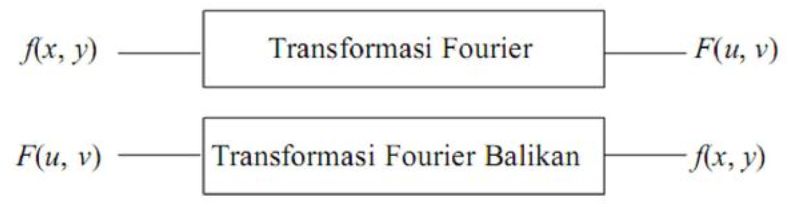

### Tugas 6 Pemrosesan Citra Digital

Nama : Delphia Aryana

NIM : 2110131220012

 

<h2 align="center">Spatial Frequency Domain </h2>

Metode untuk perbaikan kualitas citra <i>(image enhancement)</i> dapat dikelompokkan menjadi 2 kategori :

1. _Image Enhancement_ dalam ranah spasial (spatial)
2. _Image Enhancement_ dalam ranah frekuensi (frequency)

 

### 1. Domain Spasial 

Metode-metode <i>Image Enhancement</i> dalam ranah spasial dilakukan dengan memanipulasi secara langsung <i>pixel-pixel</i> di dalam citra. Domain spasial melibatkan operasi konvolusi, sehingga komputasinya lebih tinggi dan prosesnya lebih kompleks.

Metode pemrosesan citra dalam ranah ini dinyatakan sebagai :

&nbsp &nbsp &nbsp &nbsp &nbsp &nbsp &nbsp &nbsp &nbsp g(x, y) = T[f(x, y)]

Keterangan :
- f(x, y) = Citra original/citra input
- g(x, y) = Citra baru yang dimodifikasi/citra output
- T       = Sebuah transformasi yang diterapkan untuk mendapatkan citra baru (g(x,y))

Untuk citra 8-bit, f dapat mengambil nilai dari 0-255 yang dimana 0 adalah hitam dan 255 adalah putih. T bisa beroperasi pada satu <i>pixel</i>, sekelompok <i>pixel</i> bertetangga, atau keseluruhan <i>pixel</i> di dalam citra. Jadi, metode dalam ranah spasial dapat dilakukan pada aras titik<i>(pixel)</i>, aras lokal, dan aras global. Untuk lebih jelas, lihat ilustrasi berikut.

 

### 2. Domain Frekuensi

Metode-metode <i>Image Enhancement</i> dalam ranah frekuensi dilakukan dengan mengubah citra terlebih dahulu dari ranah spasial ke ranah frekuensi, baru kemudian memanipulasi nilai-nilai frekuensi tersebut. Domain frekuensi hanya dapat dilakukan pada aras global dan tidak melibatkan operasi konvolusi, sehingga komputasinya rendah cepat dan prosesnya relatif simple.

Prose perubahan fungsi dari ranah spasial ke dalam ranah frekuensi dilakukan melalui <b>Transformasi Fourier</b>. Sedangkan perubahan fungsi dari ranah frekuensi ke ranah spasial dilakukan melalui <b>Transformasi Fourier Balikan (invers)</b>.

 

## Metode Domain Spasial

 Terdapat 2 metode untuk perbaikan kualitas citra <i>(image enhancement)</i> pada domain spasial, yaitu :

 1. _Point Processing_
 2. _Mask Processing_

  

 ### a. _Point Processing_ (Operasi titik)

 
Untuk melakukan pengolahan titik pada metode ini tidak memiliki ketergantungan dengan titik-titik yang ada di sebelahnya. Titik yang ada langsung saja di ubah tanpa mempengaruhi atau dipengaruhi oleh titik yang berada di sebelahnya.

1. __Citra Negatif__

Rumus :

Contoh Hasil 

 

2. __Contrast Stretching__

Untuk mengubah kontras dari suatu image dengan cara mengubah graylevel piksel-piksel pada citra menurut fungsi s = T(r) tertentu. 

Contoh Hasil 

 

3. __Histogram Equalization__

 Histogram merupakan diagram yang menunjukkan jumlah kemunculan grey level (0-255) pada suatu citra. 

- Gambar gelap : histogram cenderung ke sebelah kiri.
- Gambar terang : histogram cenderung ke sebelah kanan.
- Gambar low contrast : histogram mengumpul di suatu tempat.
- Gambar high contrast : histogram merata di semua tempat.

4. __Image Substraction__
5. __Image Averaging__

