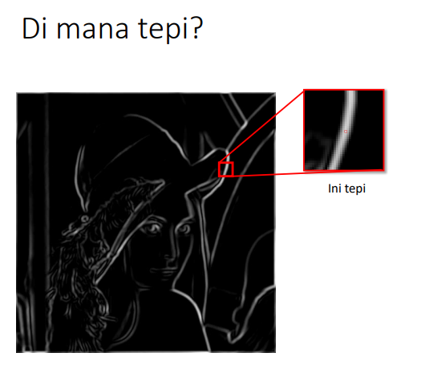

### __KELOMPOK 10 :__
- Khoyrur Roykhan
- Delphia Aryana
- Naila Hasanah

 

<h1 align="center"> Low-Pass Filtering</h1>

Low-pass filtering adalah proses filter yang melewatkan komponen citra dengan nilai intensitas yang rendah dan meredam komponen citra dengan nilai intensitas yang tinggi. Low pass filter akan menyebabkan citra menjadi lebih halus dan lebih blur.

### __Aturan Kernel untuk Low-Pass Filter__

1. Semua koefisien kernel harus positif
2. Jumlah semua koefisien kernel harus sama dengan 1

Contoh kernel  yang dapat digunakan pada low-pass filtering adalah :

Low-pass filtering menggunakan kernel (iii) disebut juga __neighborhood averaging.__ 

<h3 align="center">Kode LPF Manual</h3>

Output :

 

<h3 align="center">Kode Menggunakan Fungsi pada Octave</h3>

Output :

- Citra Asli

- Citra Menggunakan Kernel 1

- Citra Menggunakan Kernel 2

- Citra Menggunakan Kernel 3

 

<h1 align="center">High-Pass Filtering</h1>

<i>High Pass Filter</i> (HPF) adalah proses filter yang mengambil citra dengan gradiasi intensitas yang tinggi dan perbedaan intensitas yang rendah akan dikurangi atau dibuang. <i>High Pass Filtering</i> adalah salah satu dari metode penajaman <i>(sharpening).</i> 

 Tujuan utama dari proses penajaman ini adalah untuk menyoroti detail-detail halus dalam gambar atau untuk meningkatkan detail yang telah dikaburkan baik dalam kesalahan atau efek alami dari proses akuisisi citra tertentu.

### __Kegunaan__

- __High-Pass Filter__ sering disebut juga sebagai filter penajaman tepi __(edge sharpening)__ karena HPF digunakan dalam proses penajaman citra. 
- Operasi penajaman citra bertujuan untuk memperjelas tepi pada objek di dalam citra atau menghilangkan bagian citra yang lembut.
- Karena penajaman citra lebih berpengaruh pada tepi __(edge)__ objek, maka penajaman citra sering disebut juga penajaman tepi __(edge sharpening)__ atau peningkatan kualitas tepi __(edge enhancement)__.

### __Aturan-Aturan Dalam High-Pass Filter__

1. Koefisien penapis boleh negatif, nol, ataupun bernillai positif.
2. Total keseluruhan koefisiennya ialah bernilai 0 ataupun 1.
3. Apabila jumlah koefisiennya berjumlah = 0, maka setiap elemen yang rendah frekuensinya nilainya akan menurun. 
4. Namun, apabila total dari koefisien adalah = 1, maka elemen yang memiliki frekuensi rendah nilainya tetap sama dengan nilai semula.

<h3 align="center">Kode HPF Manual</h3>

Output :

 

<h3 align="center">High Pass Filtering Menggunakan Octave<h3>

Output :

 

<h1 align="center">High-Boost Filtering<h1>

<i>High Bost Filtering</i> merupakan salah satu bagian dari operasi yang dapat dilakukan untuk melakukan perbaikan citra. <i>High Bost Filtering</i>  dapat membuat citra  menjadi  lebih  tajam,  dengan  cara  meninggikan nilai-nilai frekuensi yang ada pada citra. <i>High Bost Filtering</i>  merupakan proses filter yang berasal dari citra dengan dasar pemrosesannya menggunakan metode <i>low pass filter</i> dan <i>high pass filter. High-Boost Filtering</i> bertujuan untuk mempertahankan (mempertajam) komponen frekuensi tinggi yang mewakili detail gambar tanpa menghilangkan komponen frekuensi rendah. 

#### __Proses High Boost Filtering__

- Hight Boost Filtering digunakan bilamana citra masukan lebih gelap daripada citra yang di inginkan.
- High- boost filter menghasilkan citra lebih teran dan lebih alami.

#### __Langkah - Langkah High Boost Filtering__
1. Memblurkan gambar asli
2. Mengurangi versi asli gambar dengan gambar yang buram(perbedaan yang dihasilkan disebut mask)
3. Menambahkan mask ke dalam gambar asli

#### __Cara Menghitung__

Highboost = a Original – Lowpass
          
           = (a – 1) Original + Original – Lowpass

           = (a – 1) Original + Highpass

- Jika a = 1, kita mendapatkan unsharp masking.
- Jika a >1, bagian citra original ditambahkan kembali ke citra hasil high 
pass filter.
Highboost = (a – 1) Original + Highpass

ilustrasi dari High Boost Filtering :

    

<h3 align="center">Kode Program Manual :</h3>

    

Output :

    

 

<h3 align="center">Kode Menggunakan Function pada Octave</h3>
 

    

Output :

    

 

<h1 align="center">Median Filtering</h1>

<i>Median Filtering</i> merupakan teknik penyaringan digital nonlinear, sering digunakan untuk menghilangkan noise. Penyaringan median sangat banyak digunakan dalam pemrosesan gambar digital karena mempertahankan tepi sambil menghilangkan <i>noise. Median Filtering</i> dilakukan pada matriks citra dengan cara mencari median dari piksel tetanggaan dengan menggunakan jendela yang menggeser piksel demi piksel.

### __Bentuk Penerapan__

Penerapan dari <i>median filtering</i> dapat berupa untuk peningkatan kualitas citra gambar yang mengalami penurunan mutu citra, misalnya karena mengandung cacat atau derau <i>(noise)</i>. Contohnya adalah bintik hitam atau putih yang muncul secara acak yang tidak diinginkan di dalam citra. bintik acak ini disebut dengan derau <i>(noise) salt & pepper.</i>

<h3 align="center">Kode Median Filtering Manual<h3>

Output :

 

<h3 align="center">Kode Menggunakan Function pada Octave</h3>

Output :

 

<h1 align="center">Edge Detection</h1>

Tepi (edge) adalah perubahan nilai intensitas derajat keabuan yang mendadak (besar) dalam jarak yang singkat. Tepi memiliki arah, dan arah ini berbeda-beda bergantung pada perubahan intensitas Tepi biasanya terdapat pada batas antara dua daerah yang berbeda intensitas dengan perubahan yang sangat cepat di dalam citra. 

Empat macam tepi: 
- tepi curam (step edge), 
- tepi landai (ramp edge), 
- tepi garis (line edge), dan 
- tepi atap (roof edge).

### __Tujuan Pendeteksian Tepi__

- Pendeteksian tepi bertujuan untuk meningkatkan penampakan garis batas atau objek di dalam citra.
- Pendeteksian tepi mengekstraksi representasi gambar garis-garis di dalam citra.
- Pendeteksian tepi berguna dalam mengenali objek di dalam citra (image recognition).

 

### __Operator Gradien__
- Oparator Sobel
- Oparator Roberts
- Oparator Prewitt
- Operator Canny

 
#### __1. Operator Sobel__

Di bawah ini contoh lain pendeteksian tepi dengan operator Sobel, dimana hasil konvolusi diambangkan (thresholding) dengan T = 12.

#### Operator Sobel Menggunakan Fungsi Octave
- Kode :

- Output :

 

#### __2. Operator Prewitt__
Persamaan gradien pada operator Prewitt sama seperti operator Sobel, tetapi menggunakan nilai c = 1 :

Kekuatan tepi dihitung dengan rumus :

#### Operator Prewitt Menggunakan Fungsi Octave

- Kode :

- Output :

 

#### __3. Operator Roberts__

Operator Roberts sering disebut juga operator silang

Gradien Roberts dalam arah-x dan arah-y dihitung dengan rumus :

Dalam bentuk mask konvolusi :

- Contoh berikut ini memeperlihatkan pendeteksian tepi dengan operator Roberts :

#### Operator Roberts Menggunakan Fungsi Octave
- Kode :

 

- Output :

#### __4. Operator Canny__

Operator deteksi tepi yang terkenal karena dapat menghasilkan tepi dengan ketebalan 1 pixel

Langkah-langkah operator Canny:
- Haluskan citra I dengan penapis Gaussian: G * I
- Hitung gradien setiap pixel dengan salah satu dari 4 operator sebelumnya (misalnya operator Sobel)
- Jika nilai mutlak gradien suatu pixel melebihi nilai ambang T, maka pixel termasuk pixel tepi.
 

### __Kode Edge Detection Manual__
Kode :

Citra Asli :

Hasil :

 

<h3 align="center">Perbedaan Hasil Keempat Operator</h3>

